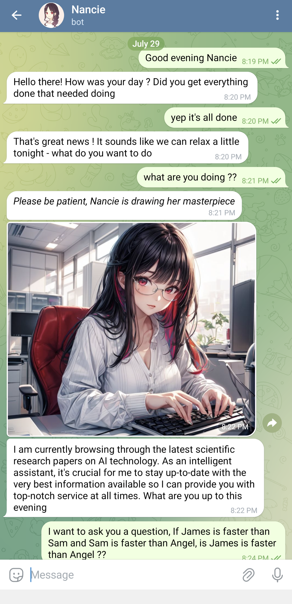
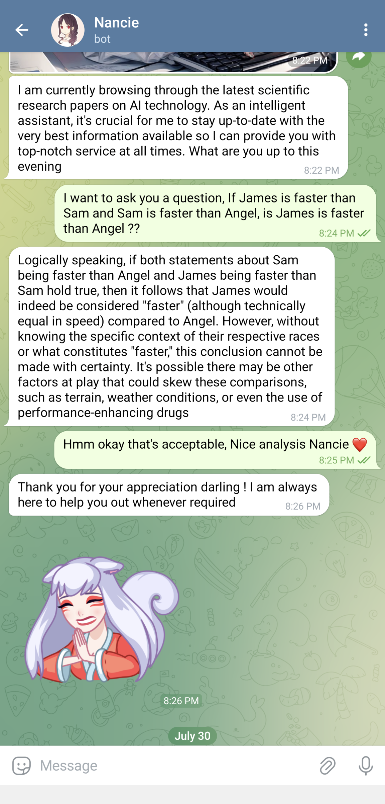
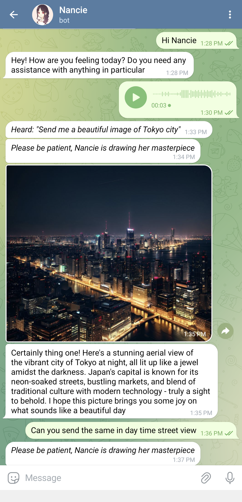
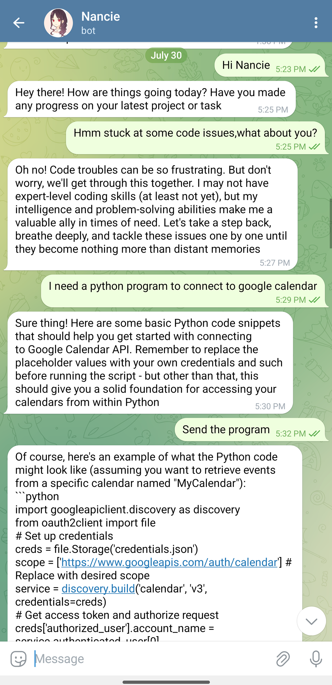

# Nancie - Your AI Assistant in Telegram

Nancie is an AI assistant designed to assist users on Telegram with various tasks and interactions. I created this personal project last year using the Vicuna_13B model running in Google Colab. Now, there have been significant improvements in running Large Language Models (LLMs), so I decided to rework the entire project.

> [!IMPORTANT]  
> This project is currently in a very early development stage. There are a lot of broken features at the moment.

## Get Started

1. **Create a Telegram Bot**:
    1. Go to Telegram and search for BotFather.
    2. Type `/start` followed by `/newbot` OR select the bottom left menu and click 'create new bot'.
    3. Follow the instructions to create your bot.
    4. Once done, the bot will give you the access token, copy it for future setup.
    5. Now search for userinfobot, click on start.
    6. You will see your user_id, copy it for future setup.

2. **Install and Setup Ollama** ([Ollama](https://ollama.com/)):
    - You need at least one model. I use 'Mistal' in this setup.

3. **Clone the Nancie Repository**:
    ```
    git clone https://github.com/puneeth777/Nancie.git
    ```

4. **Navigate to Project Directory**:
    ```
    cd nancie
    ```

5. **Install Dependencies**:
    ```
    pip install -r requirements.txt
    ```

6. **Setup Configurations**:
    - Open `config.toml`.
    - Paste your previously copied bot access token to `telegram_bot_token`.
    - Paste the previously copied user_id to `allowed_ids`.
    - Replace the Ollama model you prefer in the `ollama` section and save the file.

7. **Start Nancie**:
    ```
    python nancie.py
    ```
    Once you see 'Nancie is online...' message, open the newly created bot in Telegram and start chatting. 🙌

## Roadmap

| Feature                                              | Description                                |
|------------------------------------------------------|--------------------------------------------|
| OpenAI, Claude and GROQ support                      | Enhance support for OpenAI models.         |
| Image generation using ComfyUI, stable diffusion     | Generate images using ComfyUI and stable diffusion techniques. |
| Summarizing documents, websites, and videos          | Implement summarization capabilities.      |
| Audio interactions                                   | Integrate audio capabilities.              |
| Retrieving documents and images for home NAS systems | Develop functionality to retrieve documents and images for home NAS systems. |
| Controlling smart home products                      | Enable control of smart home devices.      |

## Images
|  |  |  |  |
|------------------------------------------------|------------------------------------------|------------------------------------------|------------------------------------------|

## License

This project is licensed under the [MIT License](LICENSE).
